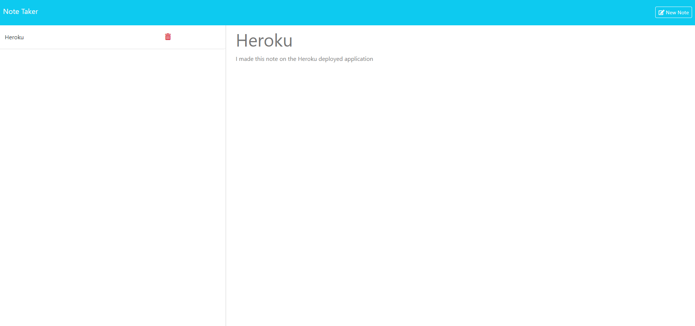

# Note Taking Helper
  
  ## Description
  This is a project that utilizes an express.js backend to handle get, post, and delete request that allow the user to save and delete notes. This project is apart of the coding bootcamp I took where we were given the front end code and had to create the backend code to make the app work. This project was a great way to learn how to use express.js and how to use it to handle requests.
    
  ## Table of Contents
  - [Installation](#installation)
  - [Usage](#usage)
  - [Contribution](#contribution)
  - [Tests](#tests)
  - [License](#license)
  ## Installation
  None, this app is deployed using Heroku and can be view here: https://salty-everglades-88879-09c75a8784c9.herokuapp.com/
  ## Usage
  To view this app just click on the above link
  ## Contribution
  For part of this project I worked with my classmate Will Schickler. We worked on getting the express.js backend to handle the get, post, and delete requests to work.
  ## Tests
  N/A
  ## License
  https://opensource.org/licenses/MIT
  Copyright <YEAR> <COPYRIGHT HOLDER>
      Permission is hereby granted, free of charge, to any person obtaining a copy of this software and associated documentation files (the “Software”), to deal in the Software without restriction, including without limitation the rights to use, copy, modify, merge, publish, distribute, sublicense, and/or sell copies of the Software, and to permit persons to whom the Software is furnished to do so, subject to the following conditions:
      The above copyright notice and this permission notice shall be included in all copies or substantial portions of the Software.
      THE SOFTWARE IS PROVIDED “AS IS”, WITHOUT WARRANTY OF ANY KIND, EXPRESS OR IMPLIED, INCLUDING BUT NOT LIMITED TO THE WARRANTIES OF MERCHANTABILITY, FITNESS FOR A PARTICULAR PURPOSE AND NONINFRINGEMENT. IN NO EVENT SHALL THE AUTHORS OR COPYRIGHT HOLDERS BE LIABLE FOR ANY CLAIM, DAMAGES OR OTHER LIABILITY, WHETHER IN AN ACTION OF CONTRACT, TORT OR OTHERWISE, ARISING FROM, OUT OF OR IN CONNECTION WITH THE SOFTWARE OR THE USE OR OTHER DEALINGS IN THE SOFTWARE.
  ## Questions
  For any questions feel free to connect with me on github or by email.
  ### Contact
  GitHub: ChaseLee21
  Email: seeberger.chase@gmail.com
